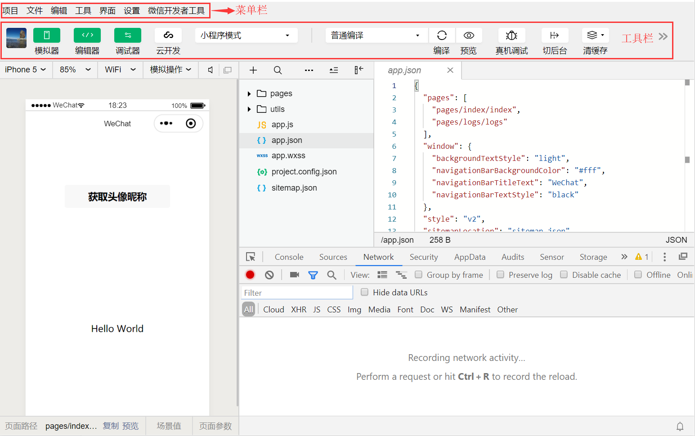

# 三 微信小程序开发工具

**本节目标**

```
1.了解小程序开发工具版本
2.了解小程序应用版本的区别
3.熟悉小程序开发者工具常见操作
```

---

### 1.开发者工具

微信官方提供小程序开发者工具当前支持三种类型版本，初学者建议用稳定版。

- 开发版：缺陷修复更新快，稳定性差
- 预发布版：通过微信内部测试，稳定性尚可
- 稳定版本：使用较多，基本稳定

### 2.工具下载地址

开发工具链接地址：https://developers.weixin.qq.com/miniprogram/dev/devtools/download.html

### 3.开发工具介绍



菜单栏

- 项目：对于项目的新建、打开、导入、查看、关闭操作
- 文件：对于项目文件的新建、保存、关闭
- 编辑：对于项目文件内容的格式编辑、及对应快捷键、搜索操作
- 工具：项目过程中用到的集成工具，如编译、预览、调试、项目详情等
- 界面：设置开发者工具界面需要显示那些区域
- 设置：微信开发者工具及项目相关设置操作
- 微信开发者工具：微信开发者工具的版本信息，账号信息等

工具栏

- 个人信息：登录当前微信开发者工具的个人头像及昵称信息
- 模拟器：开发者工具模拟手机显示当前项目可运行状态
- 编辑器：提供快捷显示/关闭项目代码区域
- 调试器：提提供快捷显示/关闭调试区域
- 云开发：通过云端提供微信服务支持，弱化后端和运维操作
- 其他工具：编译、预览、上传、清缓存、版管管理等

### 4.小程序应用版本

- 开发版：开发者工具包本地打包测试版本
- 体验版：上传到微信公众平台，发布为体验版，审核通过生成短有效期的小程序二维码
- 正式版：上传到微信公众平台，发布为正式版，审核通过生成长期的小程序二维码