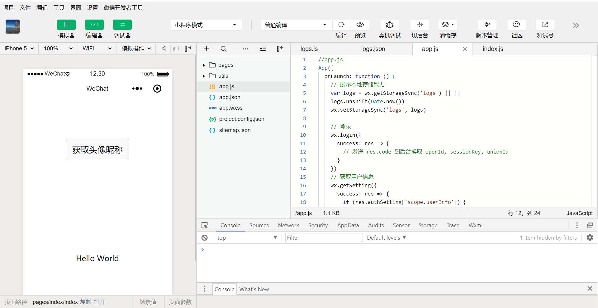
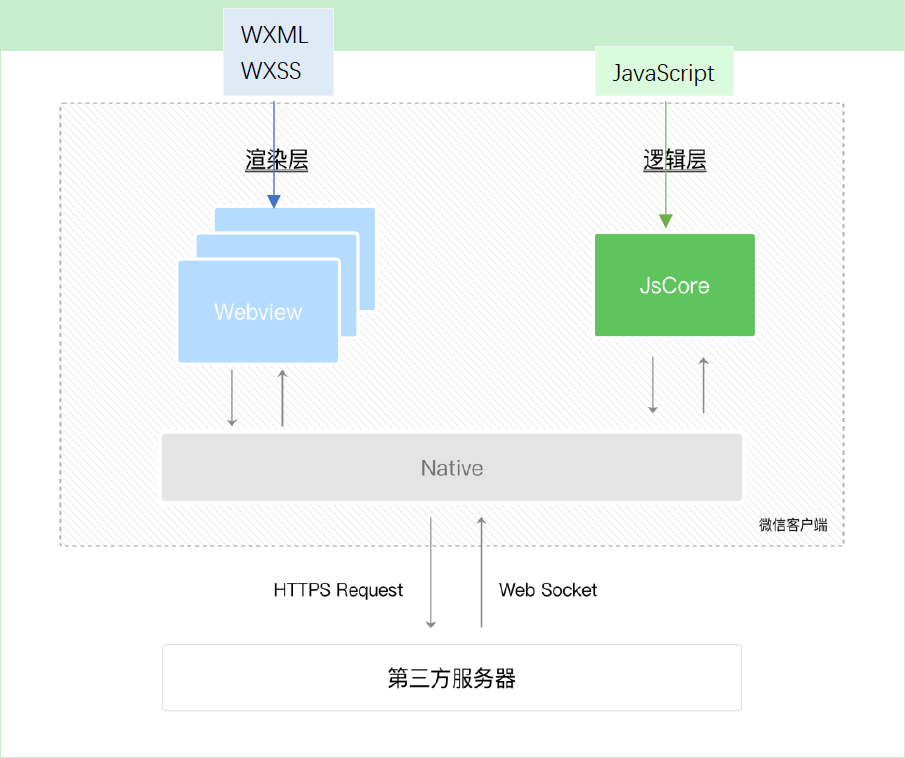

# 四  微信小程序项目结构

**本节目标**

- 了解项目结构文件
- 了解不同文件类型实现的目标
- 了解小程序运行环境

---

### 1.微信小程序的构成

微信小程序基于web端技术的应用，必备技术HTML+CSS+JavaScript，小程序对应技术WXML+WXSS+JS

- .json后缀的JSON配置文件
- .wxml后缀的WXML模板文件
- .wxss后缀的WXSS样式文件
- .js后缀的JS脚本逻辑文件

### 2.微信小程序运行环境

小程序的运行环境分成渲染层和逻辑层，其中 WXML 模板和 WXSS 样式工作在渲染层，JS 脚本工作在逻辑层。

