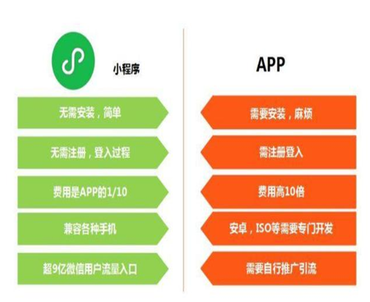

# 五 小程序与APP区别

**本节目标**

```
1.理解微信小程序与APP区别
2.能够根据小程序与APP区别设计测试点
```

---

### 1.微信小程序与APP区别

- 入口：下载、扫码
- 部署：安装、卸载、升级
- 鉴权：注册、登录、认证
- 成本：开发成本、维护成本
- 兼容：操作系统、屏幕尺寸
- 推广：人工营销、平台流量



### 2.微信小程序与APP的联系

- 移动端的应用
- 点对点的服务