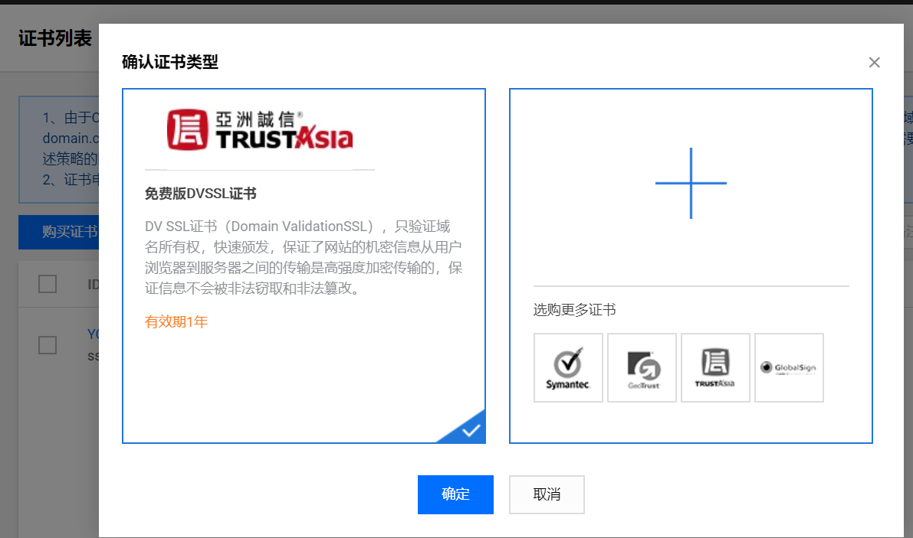

# 二 部署实施过程 

**本节目标**

```
1.熟练使用命令进行部署操作
2.能够验证项目部署结果
```

---

### 1.云服务基本操作

1.1.登录云服务平台，安装完centos系统后，查看系统OS版本

```json
cat /etc/redhat-release
#CentOS Linux release 7.6.1810 (Core)
```

1.2.修改root的账号和密码

```
root权限：
vim /etc/passwd		i编辑，第一行的第一个用户为新账号，退出并保存，Esc,x!
vim /etc/shadow		i编辑，第一行的第一个用户为新账号，退出并保存，Esc,x!
退出当前账号，再次通过新账号密码登录
```

1.3.一键安装部署系统服务，部署地址： https://lnmp.org/auto.html 

```json
#生成一键部署指令
wget http://soft.vpser.net/lnmp/lnmp1.6.tar.gz -cO lnmp1.6.tar.gz && tar zxf lnmp1.6.tar.gz && cd lnmp1.6 && LNMP_Auto="y" DBSelect="2" DB_Root_Password="lnmp.org" InstallInnodb="y" PHPSelect="5" SelectMalloc="1" ApacheSelect="2" ServerAdmin="webmaster@example.com" ./install.sh lamp
```

```json
#部署大约持续30min左右，部署完成正常结果如下截图
```


### 2.部署服务端项目

- 拷贝项目文件到指定路径下

  ```json
  #通过httpd.conf可以查看当前默认项目路径
  /home/wwwroot/default/
  #修改指定路径下项目对应文件夹权限
  chmod -R 777 /home/wwwroot/default/XXX
  ```

- 导入.sql文件(比如存放路径为/home/wwwroot/default/)

  ```json
  #进入mysql
  mysql -uroot -p
  #创建项目对应数据库
  create database myXXX;
  #进入当前数据库
  use myXXX;
  #设置数据库编码为utf8
  set names utf8;
  #直接导入对应路径下项目的.sql文件
  source /home/wwwroot/default/myXXX.sql
  ```

- 修改ssh配置远程连接数据库

  ```json
  #查看是否有ssh服务如果有会存在openssh-server
  rpm -qa | grep ssh	
  #编辑ssh配置文件
  vim /etc/ssh/sshd_config
  #开启端口22
  Port 22
  #允许root登录
  PermitRootLogin yes	
  #保存退出后重启ssh
  systemctl start sshd.service	
  ```

- 修改httpd.conf

  ```json
  #查看是否开启虚拟路径配置，取消#表示开启
  Include conf/extra/httpd-vhosts.conf
  #修改日志级别
  LogLevel error
  #开启ssl模块权限
  LoadModule ssl_module modules/mod_ssl.so
  #查看监听端口，默认是80，可以增加或者修改为其他端口
  Listen 81
  ```

- 修改httpd-vhost.conf

  ```json
  #增加或者修改为项目对应配置
  <VirtualHost *:80>
  ServerAdmin webmaster@example.com
  #php_admin_value open_basedir "/home/wwwroot/default:/tmp/:/var/tmp/:/proc/"
  ServerName  xxxx.cn
  #ServerAlias xxxx.cn
  DocumentRoot "/home/wwwroot/default/xxx/public"
  <Directory "/home/wwwroot/default/xxx/public">
      SetOutputFilter DEFLATE
      Options FollowSymLinks
      AllowOverride All
      Order allow,deny
      Allow from all
      DirectoryIndex index.html index.php
  </Directory>
  ErrorLog "/home/wwwlogs/IP-error_log"
  CustomLog "/home/wwwlogs/IP-access_log" combined
  </VirtualHost>
  ```

- 腾讯云下载免费ssl证书

  ```json
  #云产品--域名与网站--ssl证书，如下截图
  ```

  

  ```json
  #下载证书并解压，根据当前服务器配置选择对应证书上传，比如选择Apache文件夹下三个证书文件，如下截图
  ```

  

  ```json
  #将上述证书全部上传到Apache服务对应路径下，例如：/usr/local/apache/conf/
  #上传完毕后配置以下对应信息进行应用
  ```

- 设置ssl配置，以便小程序可以体验使用

  ```json
  #进入httpd-ssl.conf
  #增加信息
  <VirtualHost *:443>
  	#开启ssl
      SSLEngine on
  	#服务器证书
      SSLCertificateFile /usr/local/apache/conf/2_www.xxx.cn.crt
  	#服务器证书私钥
      SSLCertificateKeyFile /usr/local/apache/conf/3_www.xxx.cn.key
  	#CA证书公钥文件
  	SSLCACertificateFile /usr/local/apache/conf/1_root_bundle.crt
  	#服务器证书链文件（中间证书），可以没有
  	SSLCertificateChainFile /usr/local/apache/conf/4_www.xxx.cn_chain.crt
      <Directory /home/wwwroot/default/xxx/public>
          AllowOverride All
      </Directory>
      ServerAdmin email@example.com
          DocumentRoot /home/wwwroot/default/xxx/public
          ServerName www.xxx.cn
  </VirtualHost>
  ```

- 以上修改配置文件后需求重启对应服务

  ```json
  #重启Apache服务
  systemctl restart httpd
  #重启mysql服务
  systemctl restart mysql
  #重启sshd服务
  systemctl restart sshd
  #查看服务是否已经启用
  ss -tnl
  #关闭防火墙
  systemctl stop firewalld
  ```

### 3.部署客户端项目

#### 打包上传

- 通过微信开发者工具--工具栏--》--本地设置，取消勾选“不校验合法域名...”
- 微信开发者工具--工具栏--上传，提交当前项目代码


#### 平台审核

在微信公众平台管理-版本管理中选择提交为体验版/正式版，其中正式版需要微信官方审核通过才可使用。


#### 二维码生成

体验版/正式版提供生成二维码直接扫码应用

### 4.结果验证

#### 客户端验证

- 微信开发者工具模拟器
- 微信小程序真机体验

#### 服务端验证

- 本项目中可通过接口调试工具验证（postman）