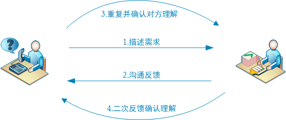

# 一 需求评审

**本节目标**

- 理解需求评审的目的
- 了解需求评审的角色

---

```
思考：为什么要进行需求评审？
```



```
目标明确、理解无误、查漏补缺、准确严谨
```

### 1.评审目的

产品角度

- 需求真实表达用户意愿
- 需求拆分粒度大小合理
- 需求描述准确严谨易懂
- 规则明确，标准清晰

开发角度

- 匹配真实业务价值大小
- 对于技术架构的影响
- 技术上是否可以实现
- 实现成本大小
- 实现方案是否可验证

测试角度

- 需求对于整个产品的价值影响
- 用户的目标和使用习惯
- 需求粒度大小和可测试成本
- 需求验证标准规范

### 2.评审结果

- 价值体现
- 查漏补缺
- 理解一致