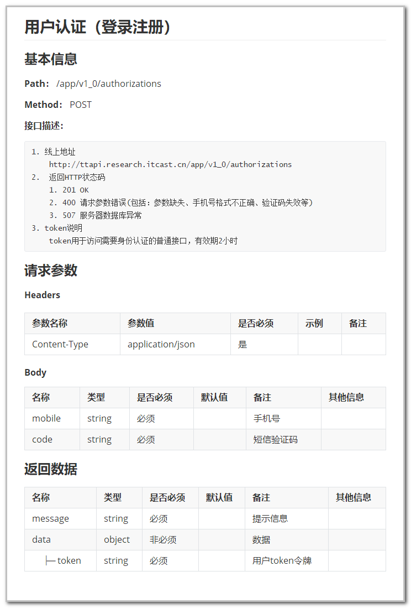

# <center>接口文档解析</center>

## 目标
    1. 知道接口文档包含的内容
    2. 掌握如何解析接口文档
---

## 1. 接口文档介绍
### 1.1 什么是接口文档？
接口文档：又称为API文档，一般是由开发人员所编写的，用来描述系统所提供接口信息的文档。
大家都根据这个接口文档进行开发，并需要一直维护和遵守。

### 1.2 为什么要写接口文档？
1. 能够让前端开发与后台开发人员更好的配合，提高工作效率。（有一个统一参考的文件）
2. 项目迭代或者项目人员更迭时，方便后期人员查看和维护
3. 方便测试人员进行接口测试

### 1.3 接口文档内容
一个规范的接口文档，要包含以下信息：
- 基本信息
 - 接口名称、请求方法、请求路径、接口描述
- 请求参数
 - 请求头
 - 请求体（包含具体的请求参数名称、参数类型、是否必须、示例、备注）
- 返回数据
 - 不同情况的响应状态码
 - 响应数据（包含具体的响应数据名称、类型、是否必须、默认值、示例、备注）

### 1.4 接口文档示例


---

## 2. 接口文档解析
小程序项目接口文档接口列表：
1. 首页
 - 轮播图
 - 专题栏位
 - 最近新品
2. 商品
 - 获取商品分类
 - 获取商品分类下的商品
 - 获取商品信息
3. 订单
 - 获取用户订单列表
 - 创建订单
 - 查看订单
4. 用户权限
 - 获取Token
 - Token验证
 - 获取地址信息

依据接口文档进行接口解析...

---

## 3. 小程序登录
### 3.1 小程序登录流程图


说明：
1. 调用 wx.login() 获取 临时登录凭证code ，并回传到开发者服务器。
2. 调用 auth.code2Session 接口，换取 用户唯一标识 OpenID 和 会话密钥 session_key。
3. 之后开发者服务器可以根据用户标识来生成自定义登录态，用于后续业务逻辑中前后端交互时识别用户身份。

### 3.2 wx.login(Object object)
调用接口获取登录凭证（code），登录凭证有效期为五分钟，并且一个code只能使用一次。

示例代码：
```js
wx.login({
  success (res) {
    if (res.code) {
      // 发起网络请求
      wx.request({
        url: 'https://test.com/onLogin',
        data: {
          code: res.code
        }
      })
    } else {
      console.log('登录失败！' + res.errMsg)
    }
  }
});
```

