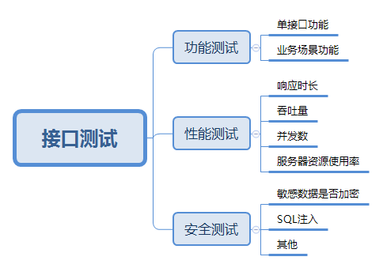
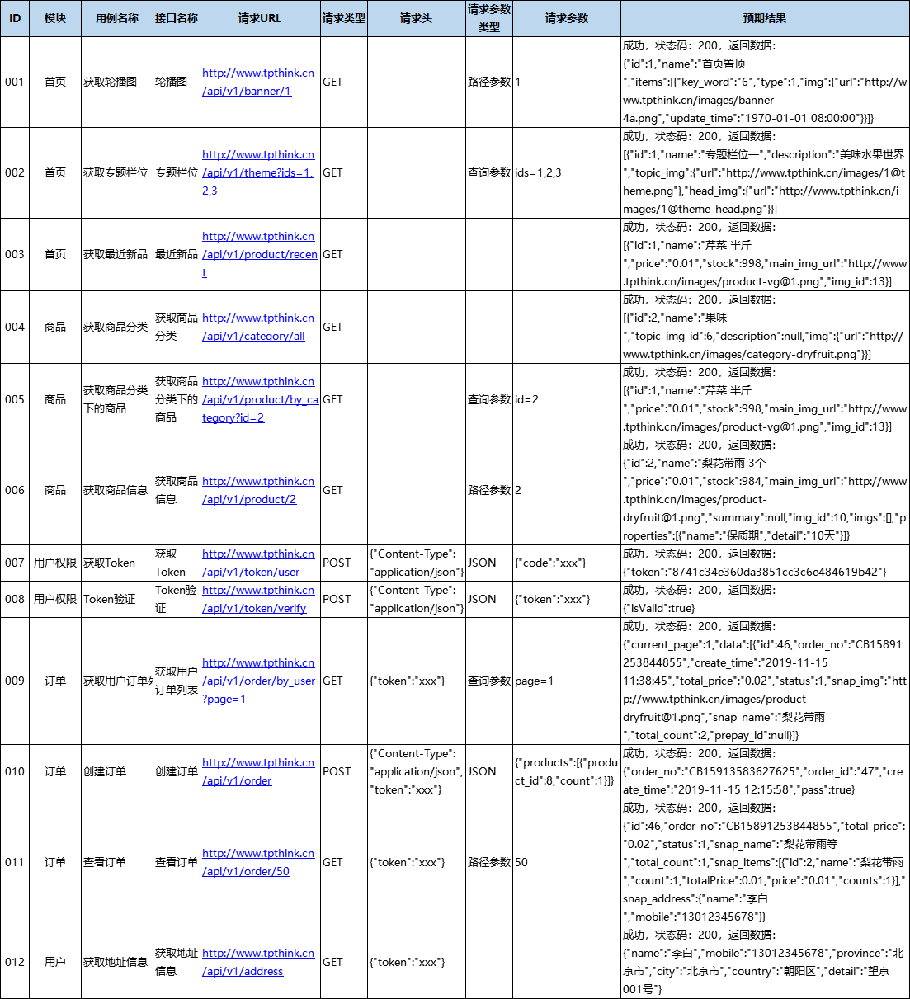

# 三 设计接口用例

**本节目标**

    1. 熟练掌握如何编写接口测试用例文档
---

## 1. 接口测试的测试点

## 2. 接口用例设计的方法与思路
> 本项目主要关注接口的功能测试

功能测试：验证接口功能是否按照接口文档实现（输入+处理+输出）
- 单接口测试
 - 正向功能：(通过性测试)
   - 仅必填参数
   - 全部参数
   - 参数组合
 - 反向测试：(异常测试)
   - 参数异常：无参、少参、多参、错误参数
   - 数据异常：数据为空、长度不符、类型不符、错误数据
   - 业务数据异常：结合业务功能考虑输出的各种异常返回情况
- 多接口测试：业务场景功能测试（站在用户角度考虑常用的使用场景）
 - 接口之间数据依赖

## 3. 接口测试用例

