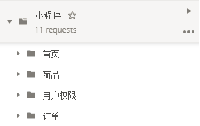
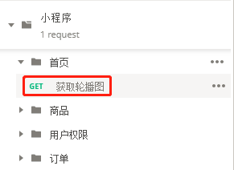
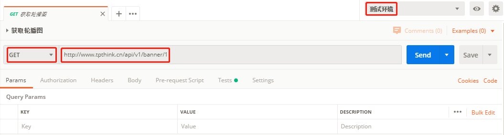
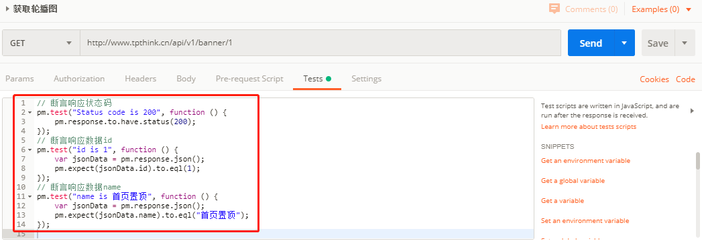
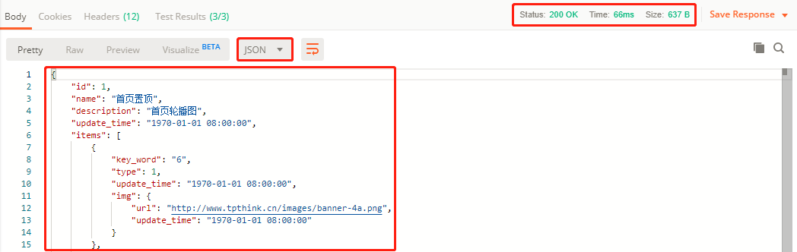
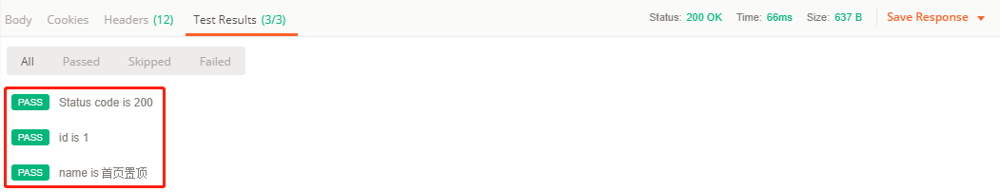

# 四 Postman实现接口测试

**本节目标**

    1. 掌握使用Postman创建用例目录结构
    2. 掌握使用Postman设置环境变量
    3. 掌握使用Postman执行接口测试
    4. 掌握使用Postman对测试结果进行断言
    5. 掌握使用Postman生成测试报告
---

## 1. 初始化工作
### 1.1 创建测试用例结构
1. 创建测试集：小程序
2. 创建目录
 - 首页
 - 商品
 - 用户权限
 - 订单



### 1.2 设置环境变量
把项目的公共配置信息可以添加到环境变量中，在请求中直接引用
- 测试环境
 - base_url=http://www.tpthink.cn/api/v1
 - code=xxx

---

## 2. 实现测试用例
根据编写的测试用例文档，使用Postman实现测试用例

### 2.1 首页-获取轮播图
#### 操作步骤
1. 在‘首页’目录下，添加‘获取轮播图’的请求
2. 填写请求数据：请求方式、请求URL、请求头、请求体
3. 在‘Tests’标签页中，编写测试脚本：断言、业务数据处理
4. 发送请求，调试脚本

#### 实现
1. 添加‘获取轮播图’的请求  

2. 填写请求数据：请求方式、请求URL

3. 编写测试脚本

4. 响应数据

5. 断言结果


---

## 3. 生成测试报告
```shell
newman run 测试脚本文件 -e 环境变量文件 -r html --reporter-html-export report.html
```

#### 操作步骤
1. 导出测试集数据
2. 导出环境变量数据
3. 执行命令：`newman run mini_program.postman_collection.json -e test.postman_environment.json -r html --reporter-html-export report.html`


