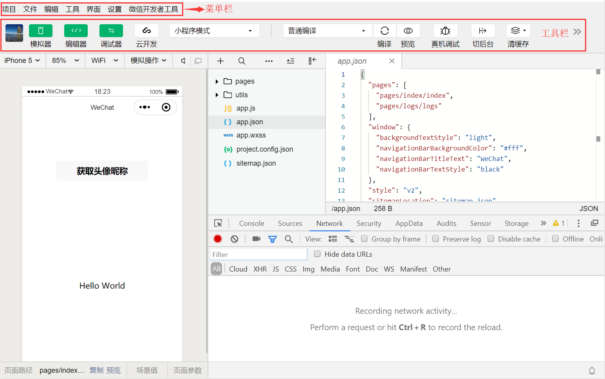
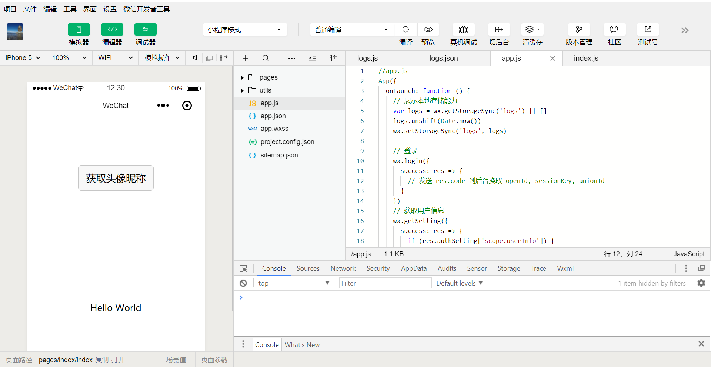

# 第一章	微信小程序介绍

**学习目标**：

- 了解微信小程序基本介绍
- 理解小程序与APP的区别
- 理解微信小程序的设计
- 了解微信小程序的开发工具
- 了解微信小程序项目结构

## 一、微信小程序的基本介绍

### 1.微信小程序背景

- 姓名：小程序，MiniProgram
- 生日：2017年1月9日
- 地位：腾讯微信最高级别战略产品（对标支付宝小程序）
- 作用：实现O2O消费闭环。为实体商家实现：线上宣传引流，在线支付，到店消费，自动关注，主动裂变
- 定位：不需要下载就可以使用的应用，将取代一切不常用的手机app，释放手机资源

### 2.微信小程序定义

​	简称小程序，英文名称Mini Program，是依附于微信而无需再次下载安装的应用程序

### 3.微信小程序特点

- 无需下载，即用即走
- 功能丰富，清爽体验
- 流量大、易裂变

### 4.微信小程序应用领域

- ​	常见成熟领域：零售、出行、医疗
- ​	使用角度覆盖：衣、食、住、行、用

## 二、微信小程序的设计

### 1.小程序设计特点

​		基于微信小程序轻快的特点，建立在充分尊重用户知情权与操作权的基础之上。旨在微信生态体系内，建立友好、高效、一致的用户体验，同时最大程度适应和支持不同需求，实现用户与小程序服务方的共赢。

- 友好礼貌：减少干扰、引导操作、礼貌服务
  - 重点突出
  - 流程明确
- 清晰明确：愉悦体验，永不迷路
  - 导航明确，来去自如
  - 减少等待，反馈及时
  - 异常可控，有路可退

### 2.小程序设计局限性

- 数量：每个应用最多能同时打开5个页面（包含页面跳转）
- 大小：小程序支持不超过8M的源码文件（分包加载，单个分包不超过2M）
- 逻辑：过于复杂逻辑存在不可控的异常问题

 https://developers.weixin.qq.com/ebook?action=get_post_info&docid=0000286f908988db00866b85f5640a 

## 三、微信小程序开发工具

### 1.开发者工具

微信官方提供小程序开发者工具当前支持三种类型版本，初学者建议用稳定版。

- 开发版：缺陷修复更新快，稳定性差
- 预发布版：通过微信内部测试，稳定性尚可
- 稳定版本：使用较多，基本稳定

### 2.工具下载地址

开发工具链接地址：https://developers.weixin.qq.com/miniprogram/dev/devtools/download.html

### 3.开发工具介绍

菜单栏

- 项目：对于项目的新建、打开、导入、查看、关闭操作
- 文件：对于项目文件的新建、保存、关闭
- 编辑：对于项目文件内容的格式编辑、及对应快捷键、搜索操作
- 工具：项目过程中用到的集成工具，如编译、预览、调试、项目详情等
- 界面：设置开发者工具界面需要显示那些区域
- 设置：微信开发者工具及项目相关设置操作
- 微信开发者工具：微信开发者工具的版本信息，账号信息等

工具栏

- 个人信息：登录当前微信开发者工具的个人头像及昵称信息
- 模拟器：开发者工具模拟手机显示当前项目可运行状态
- 编辑器：提供快捷显示/关闭项目代码区域
- 调试器：提提供快捷显示/关闭调试区域
- 云开发：通过云端提供微信服务支持，弱化后端和运维操作
- 其他工具：编译、预览、上传、清缓存、版管管理等

### 4.小程序应用版本

- 开发版：开发者工具包本地打包测试版本
- 体验版：上传到微信公众平台，发布为体验版，审核通过生成短有效期的小程序二维码
- 正式版：上传到微信公众平台，发布为正式版，审核通过生成长期的小程序二维码

## 四、微信小程序项目结构

### 1.微信小程序的构成

微信小程序基于web端技术的应用，必备技术HTML+CSS+JavaScript，小程序对应技术WXML+WXSS+JS

- .json后缀的JSON配置文件
- .wxml后缀的WXML模板文件
- .wxss后缀的WXSS样式文件
- .js后缀的JS脚本逻辑文件

### 2.微信小程序运行环境

小程序的运行环境分成渲染层和逻辑层，其中 WXML 模板和 WXSS 样式工作在渲染层，JS 脚本工作在逻辑层。

## 五、小程序与APP区别

### 1.微信小程序与APP区别

- 入口：下载、扫码
- 部署：安装、卸载、升级
- 鉴权：注册、登录、认证
- 成本：开发成本、维护成本
- 兼容：操作系统、屏幕尺寸
- 推广：人工营销、平台流量

### 2.微信小程序与APP的联系

- 移动端的应用
- 点对点的服务