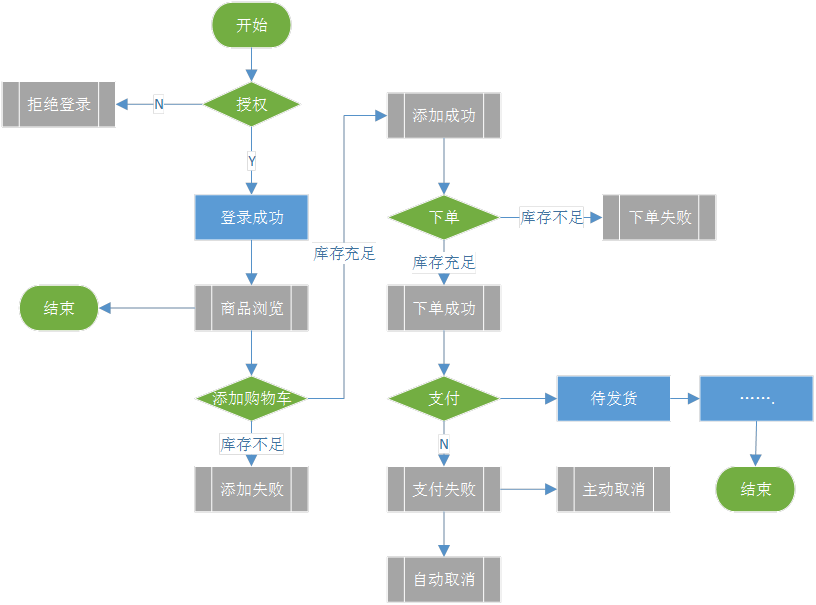

# 第二章	Ego微商项目介绍

**学习目标**

- 了解项目基本介绍
- 理解小程序项目模块构成
- 掌握小程序项目核心业务
- 理解项目测试流程

## 一、Ego微商小程序项目相关

### 1.项目介绍

​	    为了满足地方特色食品的季节性销售，借助微信公众平台的大流量入口，特设计“Ego微商”微信小程序应用，主要针对于有地方特色的食品类商品线上零售。通过微信平台在一定程度上提升了特色食品的影响力，实时满足全国各地的消费者的需求，实现轻量级应用的B2C的线上销售。  

​		该项目分前后端，前端通过WXML+WXSS+JavaScript实现客户与平台端UI交互，后端通过Apache服务器提供web应用服务，通过PHP语言实现后端接口业务，即项目框架应用是LAMP（Linux+Apache+MySQL+ThinkPHP）的技术框架。

### 2.基本模块

### 3.核心业务

​            

## 二、Ego微商小程序测试相关

### 1.测试准备

测试工具：xshell、navicat、Charles

测试设备：真实手机、手机模拟器（夜神模拟器、Genymotion）

前提：手机/模拟器需要安装微信APP，需要有WiFi/移动网络

### 2.测试流程

- 需求评审
- 编写测试计划及方案
- 设计测试用例并评审
- 执行测试用例并跟踪
- 编写测试报告及总结

