# 第四章	Ego微商小程序测试设计篇

**学习目标**

- 掌握项目测试设计过程
- 掌握功能测试设计思想
- 掌握如何提取测试点
- 理解非功能测试设计

## 一、功能测试设计

### 1.整体设计

被测对象：移动应用程序（MiniProgram）

测试过程：进入小程序、使用小程序、退出小程序

核心业务：满足微信端点对点线上商品浏览、分类选择、购买添加、下单支付、订单跟踪

### 2.拆分细化

#### 2.1按照模块布局

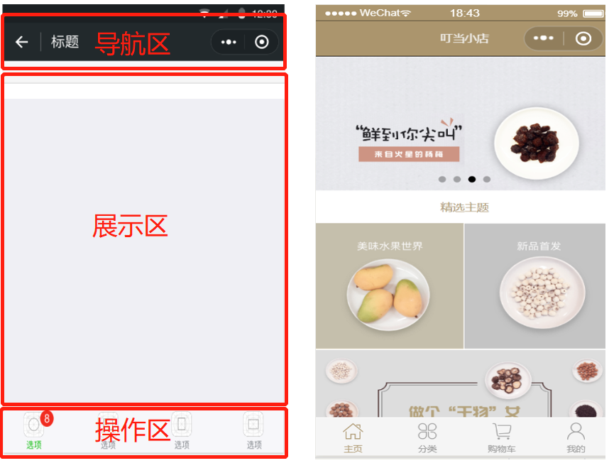

##### 2.1.1导航区

| 检查点   | Android                         | iOS                             |
| -------- | ------------------------------- | ------------------------------- |
| 标题     | 左侧位置显示，显示信息正确      | 居中显示，显示信息正确          |
| 导航     | 主页无返回，下一级页面可返回“<” | 主页无返回，下一级页面可返回“<” |
| 内嵌插件 | 转发（有权限页面）              | 转发（有权限页面）              |

##### 2.1.2操作区

| 检查点                   | 操作过程                             | 操作结果                             |
| ------------------------ | ------------------------------------ | ------------------------------------ |
| 主页、分类、购物车、我的 | 未选中按钮灰色、选中按钮和背景色一致 | 导航区展示区数据根据按钮跳转同步更新 |

##### 2.1.3展示区

###### A.主页

A-1.轮播图（banner）

- [ ] 显示：轮播图片数据、最大/小轮播数量
- [ ] 频率：自动轮播频率
- [ ] 操作：滑动操作、点击操作、返回操作

>  轮播的意义：  实现核心（钻石展位图）位置，热点产品信息的精准定位，推广引流

A-2.主题分类

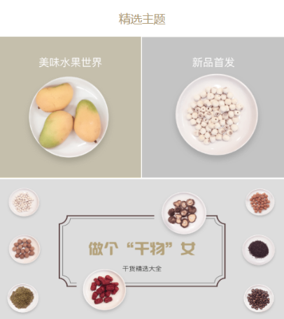

- [ ] 布局：两小一大，专题分类
- [ ] 显示：主题图片正确
- [ ] 操作：逐级进入，原路返回

A-3.新品信息

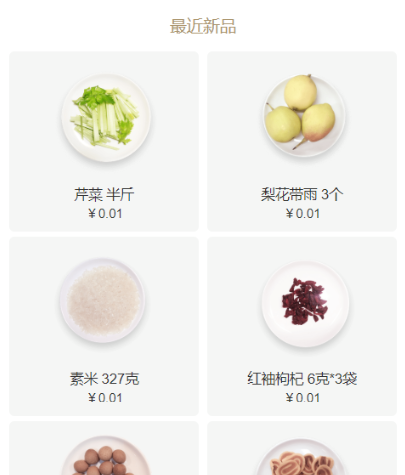

- [ ] 布局：两列并行
- [ ] 显示：图片正确、名称、单位、价格
- [ ] 操作：逐级进入，原路返回

A-4.商品详情

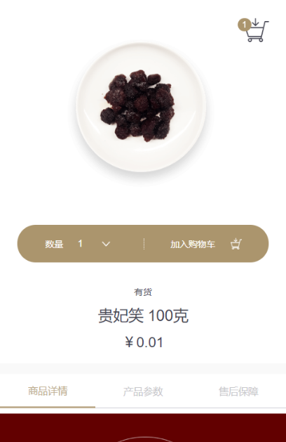

- [ ] 布局：商品图片单行；操作对象单行；商品库存、名称、信息价格居中分别显示一行；TAB切换一行；详情图片列表
- [ ] 显示：图片正确、商品状态、商品名称、数量、单位、价格、购物车显示
- [ ] 操作：数量选择、添加购物车、详情下拉、TAB页面切换操作
- [ ] 规则限制：数量限制、添加限制

A-5.专题信息

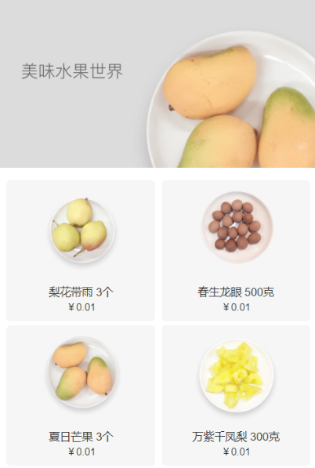

- [ ] 布局：专题图片单行；商品列表单行两列
- [ ] 显示：专题图片正确、商品信息（图片、名称、数量、价格）
- [ ] 操作：专题返回、商品进入详情、商品默认排序

###### B.分类

B-1.菜单栏

- [ ] 布局：左侧列表，占比屏幕比例约1/4
- [ ] 显示：默认灰色字体未选中；选中后与背景色一致
- [ ] 操作：切换分类，右侧区域动态切换变更

B-2.分类图

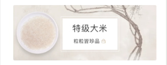

- [ ] 布局：静态图（500*200px）
- [ ] 显示：像素大小、文件大小符合设计，格式支持png

B-3.产品表

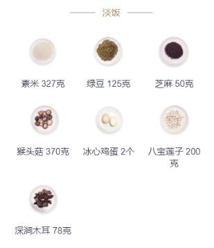

- [ ] 布局：单行分类名；列表单行3条
- [ ] 显示：分类名无误；商品图标及名称信息无误
- [ ] 操作：列表上拉加载；列表商品详情跳转，返回

###### C.购物车

C-1.空购物车

- [ ] 显示：灰色字体提示“还没有添加任何商品”，无下单操作

C-2.非空购物车

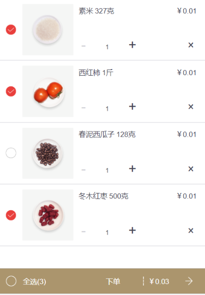

- [ ] 布局：单行商品列信息，操作栏上单行操控区域
- [ ] 显示：复选框、商品列表图、商品名称、商品单价、商品数量（可修改）、价格统计
- [ ] 操作：单选、全选，取消选中；修改商品数量，商品删除，下单
- [ ] 规则限制：数量增加/减少限制、上限限制

C-3.付款详情

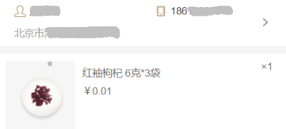

- [ ] 布局：地址文本信息两行，订单列表单行，付款合计操作单行
- [ ] 显示：地址信息（姓名、手机号、详细地址）、商品信息列表、付款合计统计付款操作；
- [ ] 操作：地址选择、付款操作

###### D.我的

D-1.个人信息

- [ ] 布局：头像+昵称，占一行
- [ ] 显示：默认头像及昵称；当前微信账号对应头像及昵称
- [ ] 操作：当前微信账号信息更新获取，头像更换、昵称修改

D-2.地址管理

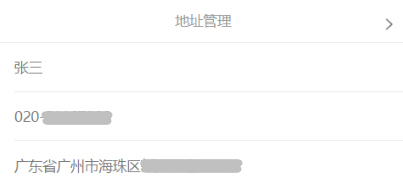

- [ ] 布局：标题（地址管理）、姓名、电话、详细地址分别占一行
- [ ] 显示：当前微信账户对应添加的地址
- [ ] 操作：地址选择和切换

D-3.我的订单

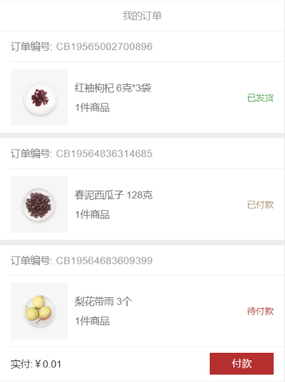

- [ ] 布局：标题（我的订单）、订单编号、商品信息各站一行
- [ ] 显示：订单编号、商品图片、商品名称信息、商品数量、订单状态（待付款、已付款、已发货、缺货）
- [ ] 操作：付款、订单详情查看

D-4.订单详情

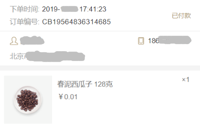

- [ ] 布局：订单信息、个人地址信息、商品列表信息、付款合计信息各自分行展示
- [ ] 显示：订单信息（下单时间、订单编号、订单状态）、商品图片、商品名称信息、商品数量、付款合计
- [ ] 操作：订单详情查看

#### 2.2基本业务流程

##### 主页

- 商品浏览

  

- 购物添加

  

- 导航返回

  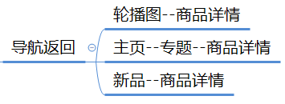

##### 分类

- 分类查看

  

- 购物添加

  

- 导航返回

  

##### 购物车

- 进入

  

- 商品量

  

- 商品选择

  

- 下单

  

- 支付

  

##### 我的

- 个人信息

  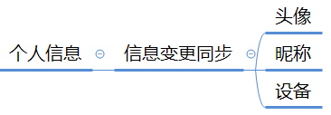

- 地址切换

  

- 订单跟踪

  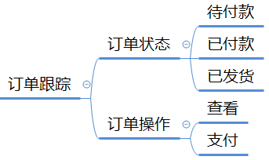

#### 2.3核心业务流程

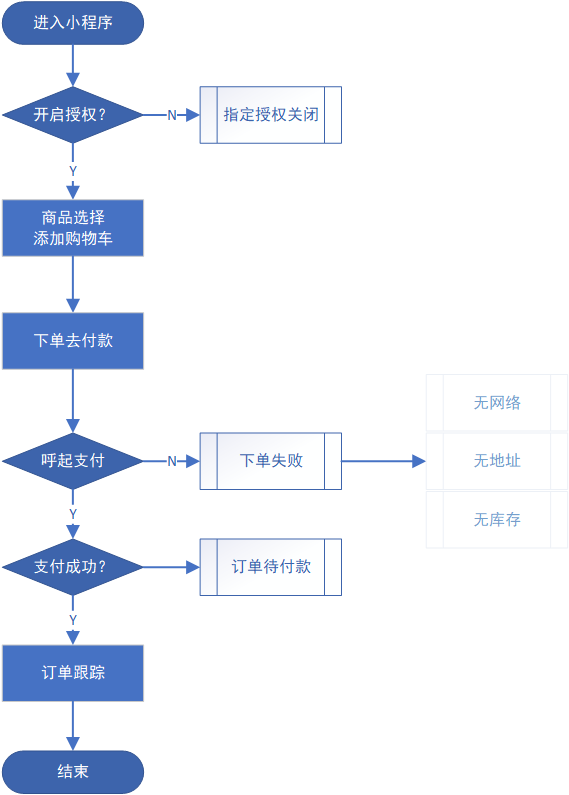

**授权提示**

## 二、界面测试设计

### 1.设计要求

| 模块     | 构成元素                             | 规格要求                                 |
| -------- | ------------------------------------ | ---------------------------------------- |
| 整体布局 | 背景颜色、字体颜色                   | \#AB956D、\#fff                          |
| 整体布局 | 字体大小：标题、展示区               | 32rpx，28rpx                             |
| 整体布局 | icon图                               | 108X108rpx，未选中灰色，选中和背景色一致 |
| 主页     | 静态图:轮播图、专题图、商品图        | 750X400px；375X375px；430X430px          |
| 主页     | 文本                                 | 28rpx                                    |
| 分类     | 静态图：分类总图、商品列表图         | 520X200rpx、51X51rpx                     |
| 分类     | 文本：分类、商品详情                 | 28rpx、24rpx                             |
| 购物车   | 静态图：商品列表图                   | 79X79rpx                                 |
| 购物车   | 文本                                 | 14X14rpx                                 |
| 购物车   | icon图标：复选框、购物车、商品列表图 | 32X32rpx、48X48rpx、64X64rpx             |
| 我的     | 按钮：付款                           | 红色背景，白色字体                       |
| 我的     | 文本                                 | 14X14rpx                                 |
| 我的     | 商品列表图                           | 64X64rpx                                 |
| 我的     | alert文本提示、icon图标提示          | 失败、成功字体/icon颜色不一样            |

### 2.用例评审

- 用例准确严谨
- 项目干系人对需求理解的一致性
- 测试执行及问题验证的依据
- 衡量产品质量的基础依据