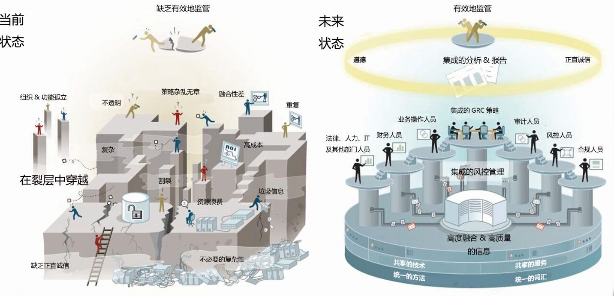

# 第四章	Ego微商小程序计划篇

**学习目标**

- 了解小程序项目测试计划方案编写
- 理解项目模块的划分及用例评审

## 一、需求评审

```
思考：为什么要进行需求评审？
```


```
目标明确、理解无误、查漏补缺、准确严谨
```

### 1.评审目的

产品角度

- 需求真实表达用户意愿
- 需求拆分粒度大小合理
- 需求描述准确严谨易懂
- 规则明确，标准清晰

开发角度

- 匹配真实业务价值大小
- 对于技术架构的影响
- 技术上是否可以实现
- 实现成本大小
- 实现方案是否可验证

测试角度

- 需求对于整个产品的价值影响
- 用户的目标和使用习惯
- 需求粒度大小和可测试成本
- 需求验证标准规范

### 2.评审结果

- 价值体现
- 查漏补缺
- 理解一致

## 二、测试计划

```
思考：为什么要编写测试计划？
```



```
流程清晰、统筹规划、团队协作、职责分明、测试高效
```

### 1.基本要素

- 项目简介

  ```
  简要描述测试计划的目的、项目的背景、专业术语解释
  ```

- 项目任务

  | 分类项   | 说明                                                         |
  | -------- | ------------------------------------------------------------ |
  | 测试目标 | 描该项目测试任务的具体目标，可量化或者有可评判的依据（参照需求说明书） |
  | 测试对象 | 软件+数据+文档构成                                           |
  | 测试范围 | 根据项目特点进行分层、分端（前/后端），由大到小逐步细化      |
  | 测试准则 | 测试过程的启动与结束标准；验收交付的标准，要求具体化         |
  | 测试流程 | 从测试流程管控跟进，确认项目各个阶段有序进行                 |
  | 测试环境 | 测试过程需要的环境数量及其配置                               |
  | 测试资源 | 工作量，各个阶段的任务、人员、时间分配；里程碑，各个阶段达到的结果 |

- 风险分析

  | 事项     | 说明                                                         |
  | -------- | ------------------------------------------------------------ |
  | 风险来源 | 测试实施过程阶段不同部门（产品、开发、测试）、不同时间可能出现的问题 |
  | 风险影响 | 正面影响，积极倡导跟进；负面影响，及时改进引导转化           |
  | 风险处理 | 回避、减少、转移、接受                                       |

- 测试方案

  | 事项     | 说明                                                         |
  | -------- | ------------------------------------------------------------ |
  | 测试分类 | 黑盒、白盒、灰盒，根据项目特性分类                           |
  | 测试方法 | 不同分类可能用到的测试设计方法                               |
  | 测试工具 | 针对当前项目可能用到的工具，如：编写文档工具、编写代码工具   |
  | 测试策略 | 最低成本验证被测对象是否符合要求（完成测试）的方式 、方法、过程 |

- 实施阶段

  ```
  按照项目进度要求，在不同阶段（单元、集成、系统、验收）按照要求准则进行有序规范执行的过程
  ```

- 测试管理

  ```
  测试过程文档管理、流程管理、测试缺陷跟踪管理
  ```

- 附录资料

  ```
  项目计划所关联的文档资料、参考资料、工具资料等信息
  ```

> 其中项目任务是测试计划的核心内容

### 2.设计构建

2.1初始阶段：结合具体项目，根据计划要素构建模板进行优化填充

- 搭建骨架
- - 项目介绍
  - 项目任务
  - 风险分析
  - 测试方案
  - 实施阶段
  - 测试管理
- 填写内容：了解项目背景，根据需求说明书提取测试设计项进行

2.2进阶阶段：结合具体项目特点，根据经验自行设计核心要素填写内容

- 重新定义要素
- 深化要素范围
- 突出项目特点